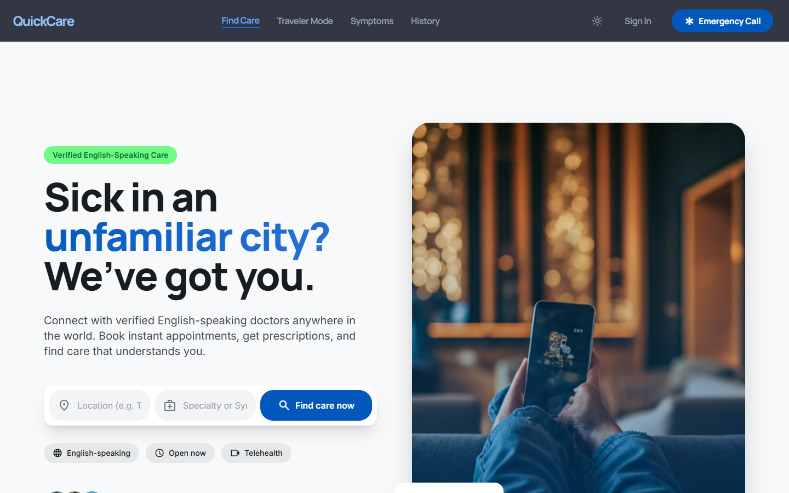
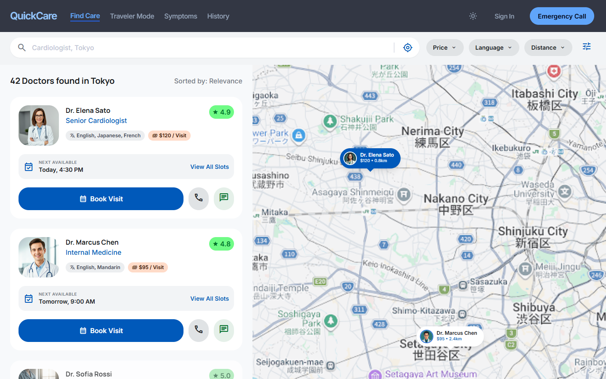
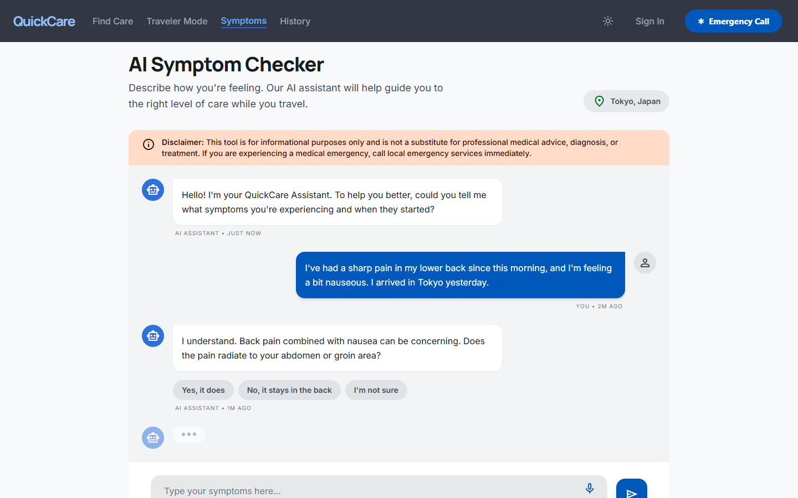
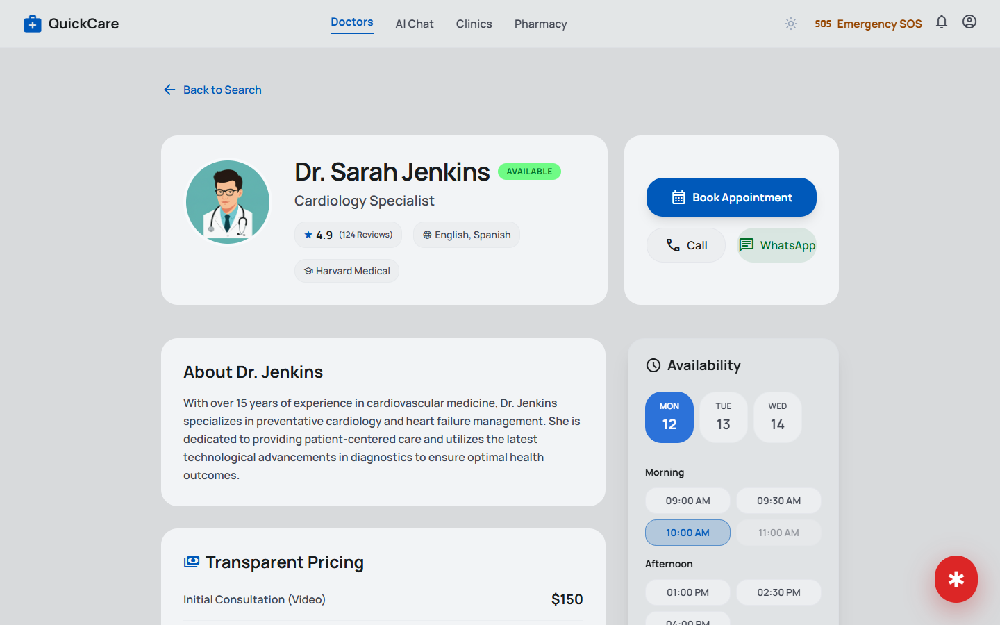
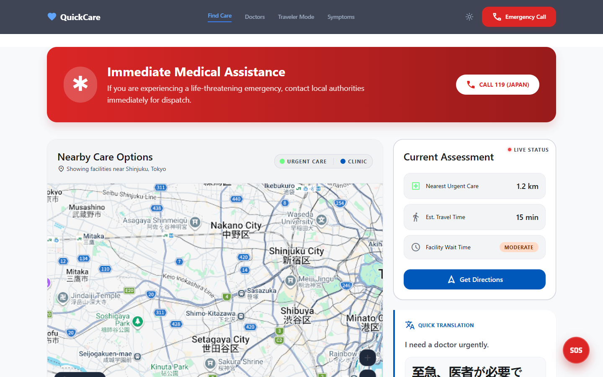
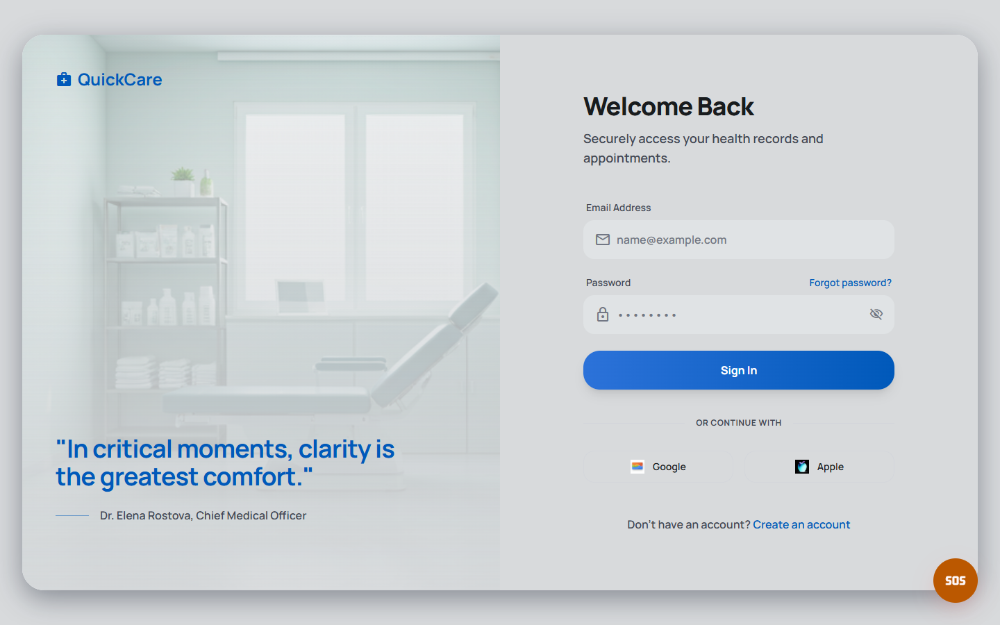
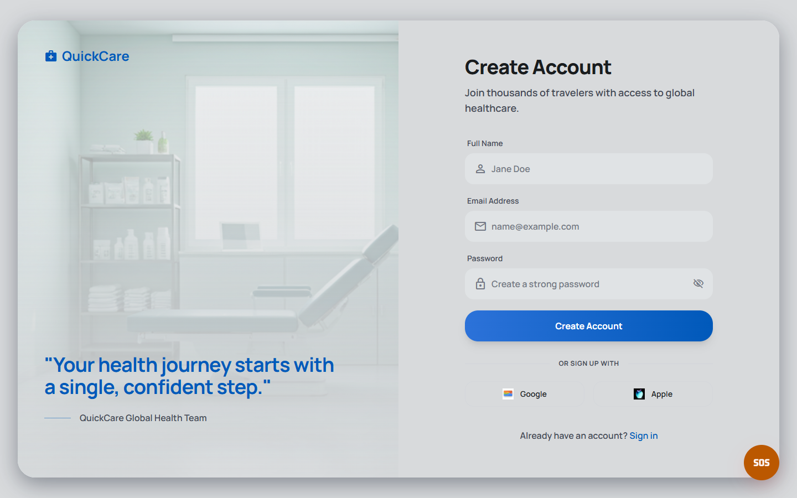

<div align="center">

# QuickCare
**Trusted Healthcare for Travelers, Anywhere, Anytime**

*QuickCare is a comprehensive medical assistance platform designed specifically for travelers. It eliminates the anxiety of falling ill in unfamiliar territories by instantly connecting users with vetted doctors, transparent pricing, and AI-driven symptom triage based on their real-time GPS location.*

[](https://quickcare-rto6.onrender.com/)
[](https://opensource.org/licenses/MIT)
[]()
[]()

<br/>
</div>

## Navigation
- [Problem Statement](#problem-statement)
- [Solution](#solution)
- [Screenshots](#screenshots)
- [Comprehensive Features](#comprehensive-features)
- [Folder Structure](#folder-structure)
- [Tech Stack Architecture](#tech-stack-architecture)
- [Run on Your Device](#run-on-your-device)
- [Credits & Acknowledgements](#credits--acknowledgements)

---

## Problem Statement

Traveling to a new city or country is an incredible experience, but experiencing a medical emergency during a trip is universally stressful. Travelers constantly struggle with:
- **Lack of Trusted Guidance:** Inability to differentiate between reputable clinics and unverified practices.
- **Severe Language Barriers:** Struggling to explain nuanced symptoms to foreign medical staff, leading to misdiagnoses.
- **Financial Uncertainty:** Facing hidden costs and exorbitant "tourist" medical fees without prior transparency.
- **Wasted Time:** Spending hours researching the appropriate specialist instead of seeking immediate care.
- **Extreme Anxiety:** Trying to navigate complex foreign healthcare systems while already feeling vulnerable and sick.

---

## Solution

**[Experience the live QuickCare application here](https://quickcare-rto6.onrender.com/)**

QuickCare completely reimagines the travel healthcare experience by acting as a centralized, intelligent medical concierge in your pocket. 

By leveraging geolocation and modern web technologies, QuickCare:
1. **Instantly Pinpoints Care:** Automatically maps your exact location to the nearest verified healthcare providers.
2. **Guarantees Transparency:** Displays upfront consultation fees, accepted insurances, and spoken languages before you ever book.
3. **Automates Triage:** Uses a localized AI Symptom Checker to evaluate your condition and recommend the exact type of specialist you need, removing the guesswork.
4. **Closes the Loop:** Guides you to the nearest open pharmacies to fulfill your prescriptions post-visit.

---

## Screenshots

| Page Name | Screenshot | Description |
|-----------|------------|-------------|
| **Landing Page** |  | Introduces the core value proposition, features quick access emergency buttons, and previews top-rated local doctors. |
| **Doctor Search** |  | A powerful directory featuring live map integration and deep filtering by distance, budget, and spoken languages. |
| **Symptom Checker** |  | An intuitive AI chat interface that processes plain-language symptom descriptions to output actionable medical advice. |
| **Doctor Profile** |  | A comprehensive provider profile showcasing educational background, verified patient reviews, and real-time scheduling slots. |
| **Traveler Mode** |  | A high-contrast emergency dashboard featuring one-tap translation cards, local SOS hotlines, and immediate triage. |
| **Login** |  | Secure, session-based authentication portal for returning users to access their medical history. |
| **Signup** |  | A frictionless onboarding experience for new travelers joining the platform. |

---

## Comprehensive Features

### Location-Based Discovery Engine
The core of QuickCare is its spatial awareness. Using standard browser Geolocation APIs, the application plots a radius around the user and queries the database for active medical facilities. This eliminates the need for users to know their exact address or neighborhood in a foreign city.

### AI-Powered Triage Chatbot
Instead of forcing users to self-diagnose (which often leads to unnecessary panic), QuickCare incorporates an intelligent chat interface. Users simply type what hurts, and the system parses the NLP input to suggest whether they need a General Practitioner, an Urgent Care clinic, or the ER.

### Verified Provider Network
Trust is the most critical component of foreign healthcare. Every doctor listed on QuickCare undergoes a rigorous vetting process. Their profiles display verified credentials, past patient ratings, and transparent base consultation fees, preventing travelers from being overcharged.

### Traveler Mode (Emergency SOS)
When every second counts, Traveler Mode strips away non-essential UI elements. It provides giant, high-contrast buttons to call local emergency services (automatically mapping to the country's local 911 equivalent), and displays pre-translated medical phrases to show to local responders.

---

## Folder Structure

QuickCare utilizes a **Coupled Architecture** monorepo structure, separating the client interface from the backend API services.

```text
QuickCare/
├── backend/                  # Node.js & Express API Server
│   ├── config/               # Database connection and environment configurations
│   ├── controllers/          # Business logic for handling API requests
│   ├── middleware/           # Custom error handlers and authentication checks
│   ├── models/               # Mongoose schemas for MongoDB data structures
│   ├── routes/               # API endpoint definitions and router logic
│   └── server.js             # Entry point: Mounts routes and serves the frontend build
│
├── frontend/                 # React 19 Client Application
│   ├── public/               # Static assets that bypass the bundler
│   ├── screenshots/          # Repository documentation images
│   └── src/
│       ├── components/       # Reusable, modular UI components (Buttons, Navbars)
│       ├── pages/            # Full-screen route components (Landing, Search, Detail)
│       ├── App.jsx           # Root component defining React Router routes
│       ├── index.css         # Global Tailwind CSS directives and design tokens
│       └── main.jsx          # React DOM mounting script
│
├── .gitignore                # Specifies intentionally untracked files
└── README.md                 # Project documentation
```

---

## Tech Stack Architecture

QuickCare is built on a modern, highly responsive JavaScript stack designed for performance and rapid iteration.

### Frontend Client
- **[React 19](https://react.dev/)**: The core UI library. We leverage the latest React 19 features for concurrent rendering and optimized state management.
- **[Vite 8](https://vitejs.dev/)**: The lightning-fast build tool and development server, utilizing Rolldown for near-instant Hot Module Replacement (HMR).
- **[Tailwind CSS v3](https://tailwindcss.com/)**: A utility-first CSS framework used to construct the custom design system directly within the JSX, ensuring consistent padding, typography, and dark-mode styling.
- **[React Router v7](https://reactrouter.com/)**: Handles complex client-side routing, enabling a seamless Single Page Application (SPA) experience without page reloads.
- **[Lucide React](https://lucide.dev/)**: A clean, beautiful, and consistent open-source icon library used extensively across the UI.

### Backend Services
- **[Node.js](https://nodejs.org/) & [Express.js](https://expressjs.com/)**: A lightweight, non-blocking runtime and web framework that handles API routing and securely serves the compiled frontend assets in production.
- **[MongoDB](https://www.mongodb.com/) & [Mongoose](https://mongoosejs.com/)**: *(Infrastructure ready)* A NoSQL document database ideal for storing complex, nested medical provider data and user profiles.

### Deployment Operations
- **[Render](https://render.com/)**: The application is deployed as a unified Web Service. The Node backend intercepts API calls while passing all standard traffic to the pre-compiled Vite static `dist` folder.

---

## Run on Your Device

Want to explore the code or run your own local instance of QuickCare? Follow these exact steps to get the project running on your local machine.

### 1. System Requirements
- Ensure **[Node.js](https://nodejs.org/en/download/)** (version 18 or higher) is installed.
- Ensure **[Git](https://git-scm.com/downloads)** is installed.

### 2. Clone the Repository
Open your terminal and pull down the source code:
```bash
git clone https://github.com/daksh006v/Quickcare.git
cd Quickcare
```

### 3. Install Dependencies & Start the Application
QuickCare's frontend is isolated in the `frontend` directory. 

```bash
# Navigate into the frontend folder
cd frontend

# Install all required NPM packages
npm install

# Boot up the Vite development server
npm run dev
```

### 4. View the App
Once the server starts, open your web browser and navigate to:
👉 **`http://localhost:5173`**

*(Note: The backend server is currently configured for production deployment. Running the frontend via Vite as shown above provides the complete UI experience).*

---

## Credits & Acknowledgements

This project was brought to life by dedicated developers striving to make global healthcare safer and more accessible.

- **Lead Developer / Designer:** [daksh006v](https://github.com/daksh006v)
- **UI/UX Inspiration:** Built using modern accessible design principles tailored for high-stress emergency situations.
- **Icons & Assets:** Powered by [Lucide](https://lucide.dev/) and Google Material Symbols.
- **Special Thanks:** To the open-source maintainers of React, Vite, and Express who make platforms like this possible.

---
<div align="center">
<i>QuickCare — Find the Right Care, Right Now.</i>
</div>